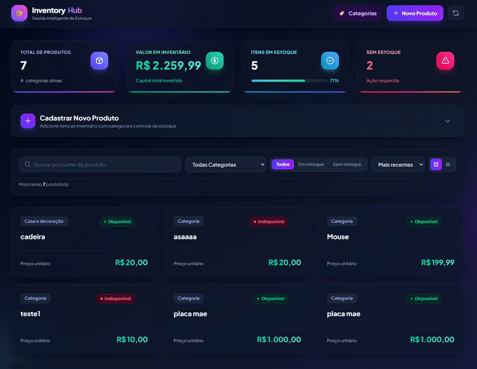

# 📦 THE INVENTORY DASHBOARD

> Sistema moderno e responsivo para controle de inventário e gestão de produtos com métricas em tempo real, filtros avançados e interface intuitiva.

## 📝 Sobre o Projeto

O **The Inventory Dashboard** é uma aplicação full-stack desenvolvida para facilitar a gestão e o monitoramento de produtos em estoque. A plataforma oferece uma interface dinâmica e moderna construída com React 19, Tailwind CSS e TypeScript no frontend, conectada a uma API REST robusta e escalável em Python com Django e Django REST Framework.

O projeto visa entregar alta usabilidade com métricas calculadas em tempo real, visualização adaptável em grade ou tabela, além de suporte completo à gestão de categorias e controle de disponibilidade de produtos.

## 🖼️ Preview



## ✨ Funcionalidades

- 📊 **Dashboard com Métricas em Tempo Real (KPIs):**
  - Total de produtos cadastrados e categorias ativas.
  - Cálculo automático do valor total do inventário em moeda local (BRL).
  - Contagem de itens em estoque com barra de progresso proporcional.
  - Alerta de itens sem estoque.
- 📦 **Gestão Completa de Produtos:**
  - Cadastro rápido de produtos (Nome, Categoria, Preço e Status de Estoque).
  - Listagem com modos de visualização em **Cards (Grid)** ou **Tabela Detalhada**.
  - Exclusão de produtos com confirmação e feedback de loading.
  - Formatação monetária padronizada (BRL).
- 🏷️ **Gerenciamento de Categorias:**
  - Modal dedicado para criação, edição e exclusão de categorias.
  - Atualização em tempo real das categorias vinculadas aos produtos.
- 🔍 **Busca, Filtros e Ordenação Avançados:**
  - Busca textual instantânea por nome do item.
  - Filtragem por categoria.
  - Filtragem por disponibilidade (Todos, Em Estoque, Sem Estoque).
  - Ordenação dinâmica por mais recentes, nome e preço (menor/maior).
- 🎨 **Interface Moderna & Responsiva:**
  - Tema escuro sofisticado com efeitos de *glassmorphism* e gradientes.
  - Layout 100% responsivo para dispositivos móveis, tablets e desktops.

## 🛠️ Tecnologias Utilizadas

### **Frontend**
- **[React 19](https://react.dev/):** Biblioteca para interfaces de usuário modernas e reativas.
- **[TypeScript](https://www.typescriptlang.org/):** Tipagem estática para robustez e manutenibilidade do código.
- **[Vite](https://vitejs.dev/):** Ferramenta de build ultrarrápida e servidor de desenvolvimento.
- **[Tailwind CSS v4](https://tailwindcss.com/):** Framework utilitário moderno para estilização ágil e consistente.
- **[Axios](https://axios-http.com/):** Cliente HTTP para integração com a API REST.

### **Backend**
- **[Python 3](https://www.python.org/):** Linguagem base do backend.
- **[Django](https://www.djangoproject.com/):** Framework web completo e seguro.
- **[Django REST Framework (DRF)](https://www.django-rest-framework.org/):** Criação de APIs RESTful e serialização de dados.
- **[django-cors-headers](https://github.com/adamchainz/django-cors-headers):** Gerenciamento de políticas de CORS.
- **[SQLite / PostgreSQL](https://www.postgresql.org/):** Banco de dados relacional (SQLite por padrão para desenvolvimento, compatível com PostgreSQL).

### **DevOps & Ferramentas**
- **[Docker & Docker Compose](https://www.docker.com/):** Containerização de todos os serviços para ambiente padronizado.
- **[Gunicorn & WhiteNoise](https://whitenoise.readthedocs.io/):** Servidor WSGI e servir arquivos estáticos prontos para deploy.

## 🚀 Como Executar o Projeto

Você pode executar o projeto de duas formas: utilizando **Docker** (recomendado) ou instalando as dependências **localmente**.

### Pré-requisitos
- [Git](https://git-scm.com/)
- [Node.js](https://nodejs.org/) (versão 18+) e `npm` *(para execução local)*
- [Python](https://www.python.org/) (versão 3.10+) e `pip` *(para execução local)*
- [Docker](https://www.docker.com/) e [Docker Compose](https://docs.docker.com/compose/) *(para execução com Docker)*

### Opção 1: Rodando com Docker (Recomendado) 🐳

1. **Clone o repositório:**
   ```bash
   git clone https://github.com/SEU_USUARIO/the-inventory-dashboard.git
   cd the-inventory-dashboard
   ```

2. **Inicie os serviços com Docker Compose:**
   ```bash
   docker-compose up --build
   ```

3. **Acesse as aplicações:**
   - **Frontend:** [http://localhost:5173](http://localhost:5173)
   - **Backend API:** [http://localhost:8000/api/](http://localhost:8000/api/)

### Opção 2: Rodando Localmente (Sem Docker) 💻

#### 1. Backend (Django / API)

1. Abra um terminal e navegue até o diretório `api`:
   ```bash
   cd api
   ```

2. Crie e ative um ambiente virtual (recomendado):
   ```bash
   # Windows (PowerShell)
   python -m venv venv
   .\venv\Scripts\activate

   # Linux/macOS
   python3 -m venv venv
   source venv/bin/activate
   ```

3. Instale as dependências:
   ```bash
   pip install -r requirements.txt
   ```

4. Execute as migrações do banco de dados:
   ```bash
   python manage.py migrate
   ```

5. Inicie o servidor da API:
   ```bash
   python manage.py runserver
   ```
   > A API estará disponível em `http://localhost:8000`.

#### 2. Frontend (React / Vite)

1. Abra um **segundo terminal** e navegue até a pasta `frontend`:
   ```bash
   cd frontend
   ```

2. Instale os pacotes npm:
   ```bash
   npm install
   ```

3. Inicie o servidor de desenvolvimento Vite:
   ```bash
   npm run dev
   ```
   > O frontend estará acessível em `http://localhost:5173`.

## 📌 Decisões de Design e Aprendizados

- **Integração Full-Stack e Relacionamento de Dados:**
  A integração entre as entidades `Category` e `Product` exigiu sincronização cuidadosa entre o DRF e o estado local no React, garantindo que atualizações de categoria refletissem de forma imediata nos produtos listados.
- **Interface e Experiência do Usuário (UX):**
  Foco em feedback instantâneo com estados de carregamento, alternância dinâmica de visualização (cards/tabela) e painéis de estatísticas dinâmicas que recalculam KPIs sem requisições adicionais desnecessárias.

## 📄 Licença

Este projeto está sob a licença MIT. Sinta-se livre para utilizá-lo e customizá-lo.
